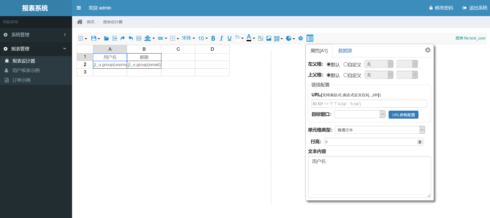
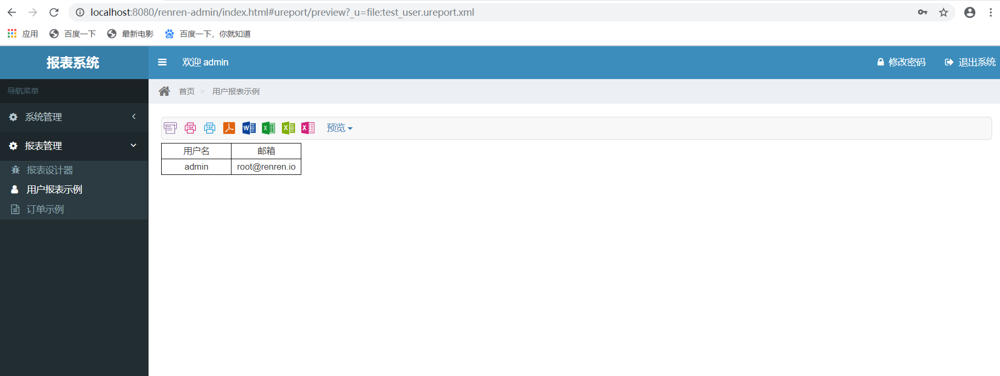
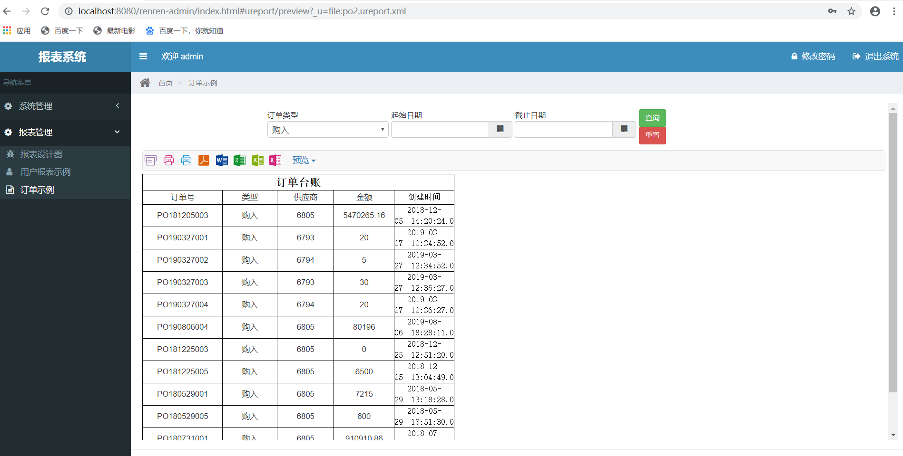
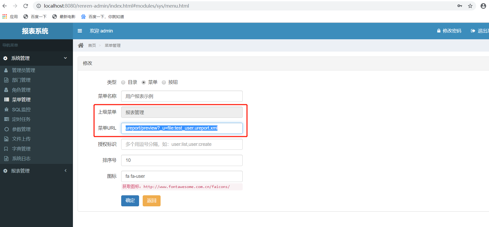

**项目说明** 
- 站在巨人的肩膀上，人人权限系统renren-security集成UReport2报表引擎。
- renren-security采用SpringBoot2.0、MyBatis、Shiro框架，开发的一套权限系统。[renren-security README.md](./README.md) renren-security Gitee地址: https://gitee.com/renrenio/renren-security
- UReport2是一款高性能的Java报表引擎，提供完善的基于网页的报表设计器，可快速做出各种复杂的中式报表。 Gitee地址: https://gitee.com/youseries/ureport  Github地址: https://github.com/youseries/ureport

**集成说明** 
- 按UReport2官方资料配置 http://wiki.bsdn.org/pages/viewpage.action?pageId=76448360
- renren-security下新建maven module, 详见该项目下的renren-ureport模块
- renren-security下的XssFilter放开/ureport的请求, 详见XssFilter和FilterConfig文件
- renren-security下的application.yml 增加配置项ureport.disableAuth=true (true 禁止权限验证,对外开放; false 开启权限验证,关闭对外开放，客户端访问报表则必须登录), 详见ShiroConfig文件
- renren-security下的application-dev.yml,application-prod.yml增加配置项ureport.fileStoreDir=D:/ureportfiles (UReport2的报表存储路径,不同的系统环境可分别配置)
- UReport2的报表设计器地址：http://localhost:8080/renren-admin/ureport/designer 或者 http://localhost:8080/renren-admin/index.html#ureport/designer
- 第三方客户端直接查看UReport2的业务报表地址：http://localhost:8080/renren-admin/ureport/preview?_u=file:文件名.ureport.xml

**效果图**

