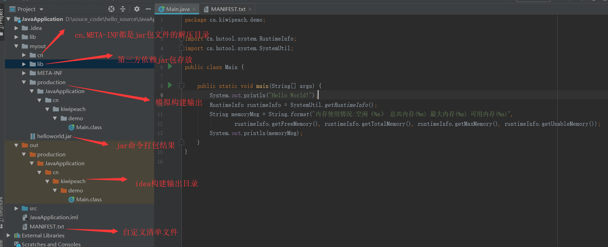

    通常在一般情况下我们开发Java程序都使用IDE进行快速开发，但是若能够了解整个java程序的编译构建代码的过程就更好了，这样对开发工具的行为也会有更深的理解，对自己的软件开发思想也会有进一步的提升，下面是对照idea的编译执行行为来进行分析和学习。

### 1.IDEA工程目录结构

##### idea编译输出路径



##### idea编译命令行

  java -javaagent <?>  --Dfile.encoding=UTF-8 -classpath%JAVA_HOME%\jre\lib\xx.jar

```shell
D:\home_jdk\1.8x64\jdk1.8.0_40\bin\java.exe -javaagent:D:\JetBrains\Toolbox\apps\IDEA-U\ch-0\183.5429.1\lib\idea_rt.jar=7231:D:\JetBrains\Toolbox\apps\IDEA-U\ch-0\183.5429.1\bin -Dfile.encoding=UTF-8 -classpath D:\home_jdk\1.8x64\jdk1.8.0_40\jre\lib\charsets.jar;D:\home_jdk\1.8x64\jdk1.8.0_40\jre\lib\deploy.jar;D:\home_jdk\1.8x64\jdk1.8.0_40\jre\lib\ext\access-bridge-64.jar;D:\home_jdk\1.8x64\jdk1.8.0_40\jre\lib\ext\cldrdata.jar;D:\home_jdk\1.8x64\jdk1.8.0_40\jre\lib\ext\dnsns.jar;D:\home_jdk\1.8x64\jdk1.8.0_40\jre\lib\ext\jaccess.jar;D:\home_jdk\1.8x64\jdk1.8.0_40\jre\lib\ext\jfxrt.jar;D:\home_jdk\1.8x64\jdk1.8.0_40\jre\lib\ext\localedata.jar;D:\home_jdk\1.8x64\jdk1.8.0_40\jre\lib\ext\nashorn.jar;D:\home_jdk\1.8x64\jdk1.8.0_40\jre\lib\ext\sunec.jar;D:\home_jdk\1.8x64\jdk1.8.0_40\jre\lib\ext\sunjce_provider.jar;D:\home_jdk\1.8x64\jdk1.8.0_40\jre\lib\ext\sunmscapi.jar;D:\home_jdk\1.8x64\jdk1.8.0_40\jre\lib\ext\sunpkcs11.jar;D:\home_jdk\1.8x64\jdk1.8.0_40\jre\lib\ext\zipfs.jar;D:\home_jdk\1.8x64\jdk1.8.0_40\jre\lib\javaws.jar;D:\home_jdk\1.8x64\jdk1.8.0_40\jre\lib\jce.jar;D:\home_jdk\1.8x64\jdk1.8.0_40\jre\lib\jfr.jar;D:\home_jdk\1.8x64\jdk1.8.0_40\jre\lib\jfxswt.jar;D:\home_jdk\1.8x64\jdk1.8.0_40\jre\lib\jsse.jar;D:\home_jdk\1.8x64\jdk1.8.0_40\jre\lib\management-agent.jar;D:\home_jdk\1.8x64\jdk1.8.0_40\jre\lib\plugin.jar;D:\home_jdk\1.8x64\jdk1.8.0_40\jre\lib\resources.jar;D:\home_jdk\1.8x64\jdk1.8.0_40\jre\lib\rt.jar;D:\souce_code\hello_source\JavaApplication\out\production\JavaApplication cn.kiwipeach.demo.Main
```

### 2.命令行模拟编译(javac)

##### javac帮助命令

```shell
>javac -help
用法: javac <options> <source files>
其中, 可能的选项包括:
  -g                         生成所有调试信息
  -g:none                    不生成任何调试信息
  -g:{lines,vars,source}     只生成某些调试信息
  -nowarn                    不生成任何警告
  -verbose                   输出有关编译器正在执行的操作的消息
  -deprecation               输出使用已过时的 API 的源位置
  -classpath <路径>            指定查找用户类文件和注释处理程序的位置
  -cp <路径>                   指定查找用户类文件和注释处理程序的位置
  -sourcepath <路径>           指定查找输入源文件的位置
  -bootclasspath <路径>        覆盖引导类文件的位置
  -extdirs <目录>              覆盖所安装扩展的位置
  -endorseddirs <目录>         覆盖签名的标准路径的位置
  -proc:{none,only}          控制是否执行注释处理和/或编译。
  -processor <class1>[,<class2>,<class3>...] 要运行的注释处理程序的名称; 绕过默认的搜索进程
  -processorpath <路径>        指定查找注释处理程序的位置
  -parameters                生成元数据以用于方法参数的反射
  -d <目录>                    指定放置生成的类文件的位置
  -s <目录>                    指定放置生成的源文件的位置
  -h <目录>                    指定放置生成的本机标头文件的位置
  -implicit:{none,class}     指定是否为隐式引用文件生成类文件
  -encoding <编码>             指定源文件使用的字符编码
  -source <发行版>              提供与指定发行版的源兼容性
  -target <发行版>              生成特定 VM 版本的类文件
  -profile <配置文件>            请确保使用的 API 在指定的配置文件中可用
  -version                   版本信息
  -help                      输出标准选项的提要
  -A关键字[=值]                  传递给注释处理程序的选项
  -X                         输出非标准选项的提要
  -J<标记>                     直接将 <标记> 传递给运行时系统
  -Werror                    出现警告时终止编译
  @<文件名>                     从文件读取选项和文件名
```

##### 编译输出

```shell
#如果不存在编译输出目录则创建编译输出目录
>IF NOT EXIST myout\production\JavaApplication MD myout\production\JavaApplication

#编译到myout输出目录
>javac -d myout\production\JavaApplication src\cn\kiwipeach\demo\Main.java

#编译源文件中存在中文
>javac -d myout\production\JavaApplication src\cn\kiwipeach\demo\Main.java -encoding UTF-8

#编译源文件引用了第三方jar包
>javac -d myout\production\JavaApplication src\cn\kiwipeach\demo\Main.java -encoding UTF-8 -cp lib/hutool-all-4.5.1.jar

#执行命令
>java -cp myout\production\JavaApplication cn.kiwipeach.demo.Main

#加入第三方jar包执行
>java -cp lib/hutool-all-4.5.1.jar;myout\production\JavaApplication cn.kiwipeach.demo.Main

Hello World!
内存使用情况:空闲（246329200） 总共内存(251658240) 最大内存(3711959040) 可用内存(3706630000)
```

##### 编译输出优化

```shell
#源码输出路径
set SOURCE_SRC=src
set TAGET_JAVAFILE=Main
set OUT_PATH=myout\production\JavaApplication
set PACKAGE_PATH=cn\kiwipeach\demo
set PACKAGE_NAME=cn.kiwipeach.demo

#如果不存在编译输出目录则创建编译输出目录
IF NOT EXIST %OUT_PATH% MD %OUT_PATH%

#编译到myout输出目录
javac -d %OUT_PATH% %SOURCE_SRC%\%PACKAGE_PATH%\%TAGET_JAVAFILE%.java

#执行命令
java -cp %OUT_PATH% %PACKAGE_NAME%.%TAGET_JAVAFILE%

```

### 3.命令行模拟打包(jar)

##### java帮助命令

```shell
>java -help
用法: java [-options] class [args...]
           (执行类)
   或  java [-options] -jar jarfile [args...]
           (执行 jar 文件)
其中选项包括:
    -d32          使用 32 位数据模型 (如果可用)
    -d64          使用 64 位数据模型 (如果可用)
    -server       选择 "server" VM
                  默认 VM 是 server.
    -cp <目录和 zip/jar 文件的类搜索路径>
    -classpath <目录和 zip/jar 文件的类搜索路径>
                  用 ; 分隔的目录, JAR 档案
                  和 ZIP 档案列表, 用于搜索类文件。
    -D<名称>=<值>
                  设置系统属性
    -verbose:[class|gc|jni]
                  启用详细输出
    -version      输出产品版本并退出
    -version:<值>
                  需要指定的版本才能运行
    -showversion  输出产品版本并继续
    -jre-restrict-search | -no-jre-restrict-search
                  在版本搜索中包括/排除用户专用 JRE
    -? -help      输出此帮助消息
    -X            输出非标准选项的帮助
    -ea[:<packagename>...|:<classname>]
    -enableassertions[:<packagename>...|:<classname>]
                  按指定的粒度启用断言
    -da[:<packagename>...|:<classname>]
    -disableassertions[:<packagename>...|:<classname>]
                  禁用具有指定粒度的断言
    -esa | -enablesystemassertions
                  启用系统断言
    -dsa | -disablesystemassertions
                  禁用系统断言
    -agentlib:<libname>[=<选项>]
                  加载本机代理库 <libname>, 例如 -agentlib:hprof
                  另请参阅 -agentlib:jdwp=help 和 -agentlib:hprof=help
    -agentpath:<pathname>[=<选项>]
                  按完整路径名加载本机代理库
    -javaagent:<jarpath>[=<选项>]
                  加载 Java 编程语言代理, 请参阅 java.lang.instrument
    -splash:<imagepath>
                  使用指定的图像显示启动屏幕
有关详细信息, 请参阅 http://www.oracle.com/technetwork/java/javase/documentation/index.html。
```

##### jar帮助命令

```shell
>jar -help
非法选项: h
用法: jar {ctxui}[vfmn0Me] [jar-file] [manifest-file] [entry-point] [-C dir] files ...
选项:
    -c  创建新档案
    -t  列出档案目录
    -x  从档案中提取指定的 (或所有) 文件
    -u  更新现有档案
    -v  在标准输出中生成详细输出
    -f  指定档案文件名
    -m  包含指定清单文件中的清单信息
    -n  创建新档案后执行 Pack200 规范化
    -e  为绑定到可执行 jar 文件的独立应用程序
        指定应用程序入口点
    -0  仅存储; 不使用任何 ZIP 压缩
    -M  不创建条目的清单文件
    -i  为指定的 jar 文件生成索引信息
    -C  更改为指定的目录并包含以下文件
如果任何文件为目录, 则对其进行递归处理。
清单文件名, 档案文件名和入口点名称的指定顺序
与 'm', 'f' 和 'e' 标记的指定顺序相同。

示例 1: 将两个类文件归档到一个名为 classes.jar 的档案中:
       jar cvf classes.jar Foo.class Bar.class
示例 2: 使用现有的清单文件 'mymanifest' 并
           将 foo/ 目录中的所有文件归档到 'classes.jar' 中:
       jar cvfm classes.jar mymanifest -C foo/ .
```

##### 打包jar包文件

> -C  指定编译输出位置，否则打包后会将不必要的路径（myout/production/JavaApplication）也打包进去。

```shell
#创建jar包文件
>jar -cvf myout/helloworld.jar -C myout/production/JavaApplication cn/kiwipeach/demo/Main.class
已添加清单
正在添加: cn/kiwipeach/demo/Main.class(输入 = 432) (输出 = 303)(压缩了 29%)

#查看jar包文件清单
>jar -tvf helloworld.jar
     0 Fri Oct 04 00:31:38 CST 2019 META-INF/
    68 Fri Oct 04 00:31:38 CST 2019 META-INF/MANIFEST.MF
   432 Thu Oct 03 20:03:58 CST 2019 cn/kiwipeach/demo/Main.class .
```

##### 打包含有`MANIFEST.MF`文件的jar包

```shell
#开始打包（含有清单文件）
>jar -cvf myout/helloworld.jar -C myout/production/JavaApplication cn/kiwipeach/demo/Main.class
已添加清单
正在添加: cn/kiwipeach/demo/Main.class(输入 = 432) (输出 = 303)(压缩了 29%)

#查看jar包文件清单
>jar -tvf helloworld.jar
     0 Fri Oct 04 00:31:38 CST 2019 META-INF/
    68 Fri Oct 04 00:31:38 CST 2019 META-INF/MANIFEST.MF
   432 Thu Oct 03 20:03:58 CST 2019 cn/kiwipeach/demo/Main.class .

#开始打包（不含有清单文件）
>jar -cvfM helloworld.jar -C myout/production/JavaApplication cn/kiwipeach/demo/Main.class
正在添加: cn/kiwipeach/demo/Main.class(输入 = 432) (输出 = 303)(压缩了 29%)

#查看打包文件信息
>jar -tvf helloworld.jar
432 Thu Oct 03 20:03:58 CST 2019 cn/kiwipeach/demo/Main.class

#执行jar包Main函数
>java -cp helloworld.jar cn.kiwipeach.demo.Main
Hello World!
```

##### 为jar包指定Main-Class

```shell
#解压jar包的清单文件
>jar -xvf helloworld.jar
  已创建: META-INF/
  已解压: META-INF/MANIFEST.MF
  已创建: cn/
  已创建: cn/kiwipeach/
  已创建: cn/kiwipeach/demo/
  已解压: cn/kiwipeach/demo/Main.class

#查看清单文件
>type META-INF\MANIFEST.MF
Manifest-Version: 1.0
Created-By: 1.8.0_40 (Oracle Corporation)

#打包时候指定Main-Class,通过-e参数
>jar -cvfe myout/helloworld.jar cn.kiwipeach.demo.Main  -C myout/production/JavaApplication cn/kiwipeach/demo/Main.class
已添加清单
正在添加: cn/kiwipeach/demo/Main.class(输入 = 432) (输出 = 303)(压缩了 29%)

#直接执行，而无需指定Main-Class
>java -jar helloworld.jar
Hello World!

#查看jar包文件信息
>jar -tvf helloworld.jar
     0 Thu Oct 03 23:52:16 CST 2019 META-INF/
   104 Thu Oct 03 23:52:16 CST 2019 META-INF/MANIFEST.MF
   432 Thu Oct 03 20:03:58 CST 2019 cn/kiwipeach/demo/Main.class

#将jar包进行解压
>java -xvf helloworld.jar
Unrecognized option: -xvf
Error: Could not create the Java Virtual Machine.
Error: A fatal exception has occurred. Program will exit.

#查看清单文件中的信息，发现里面添加了Main-Class文件信息
>type META-INF\MANIFEST.MF
Manifest-Version: 1.0
Created-By: 1.8.0_40 (Oracle Corporation)
Main-Class: cn.kiwipeach.demo.Main
```

##### 引用第三方jar包

```shell
#Main方法中引入第三方jar包依赖
import cn.hutool.system.RuntimeInfo;
import cn.hutool.system.SystemUtil;

#新增清单文件（ MANIFEST.txt中的信息会追加到jar包中的META-INF/MANIFEST.MF文件中）
>type MANIFEST.txt
Built-By: 刘卜铷
Class-Path: lib\hutool-all-4.5.1.jar

#将jar包打包到清单文件中
>jar -cvfm myout/helloworld.jar MANIFEST.txt -C myout/production/JavaApplication cn/kiwipeach/demo/Main.class

#解压jar包中的文件信息
>jar -xvf helloworld.jar
  已创建: META-INF/
  已解压: META-INF/MANIFEST.MF
  已解压: cn/kiwipeach/demo/Main.class

#此时查看jar包中的文件
>type META-INF\MANIFEST.MF
Manifest-Version: 1.0
Built-By: 刘卜铷
Class-Path: lib\hutool-all-4.5.1.jar
Created-By: 1.8.0_40 (Oracle Corporation)

#执行jar包，发现此时可以不用带 -cp可选项和Main入口文件了

```

### 4.JVM虚拟机参数、程序入参、环境变量探索

##### VM options

```shell
-XX:+PrintGCDetails -Xms4m -Xmx20m -XX:+HeapDumpOnOutOfMemoryError -XX:HeapDumpPath=javaapplication.hprof
```

##### Program arguments

```shell
#空格分隔
java -cp xxx.Main apple oranage banana
```

##### Environment Variables

```shell
set EMAIL=1099501218@qq.com
```

### 附录

#### idea中编译命令格式化

```shell
#linux中jar分割用':',windows上用';'
D:\home_jdk\1.8x64\jdk1.8.0_40\bin\java.exe 
-javaagent:D:\JetBrains\Toolbox\apps\IDEA-U\ch-0\183.5429.1\lib\idea_rt.jar=7231:D:\JetBrains\Toolbox\apps\IDEA-U\ch-0\183.5429.1\bin 
-Dfile.encoding=UTF-8 
-classpath D:\home_jdk\1.8x64\jdk1.8.0_40\jre\lib\charsets.jar;
D:\home_jdk\1.8x64\jdk1.8.0_40\jre\lib\deploy.jar;
D:\home_jdk\1.8x64\jdk1.8.0_40\jre\lib\ext\access-bridge-64.jar;
D:\home_jdk\1.8x64\jdk1.8.0_40\jre\lib\ext\cldrdata.jar;
D:\home_jdk\1.8x64\jdk1.8.0_40\jre\lib\ext\dnsns.jar;
D:\home_jdk\1.8x64\jdk1.8.0_40\jre\lib\ext\jaccess.jar;
D:\home_jdk\1.8x64\jdk1.8.0_40\jre\lib\ext\jfxrt.jar;
D:\home_jdk\1.8x64\jdk1.8.0_40\jre\lib\ext\localedata.jar;
D:\home_jdk\1.8x64\jdk1.8.0_40\jre\lib\ext\nashorn.jar;
D:\home_jdk\1.8x64\jdk1.8.0_40\jre\lib\ext\sunec.jar;
D:\home_jdk\1.8x64\jdk1.8.0_40\jre\lib\ext\sunjce_provider.jar;
D:\home_jdk\1.8x64\jdk1.8.0_40\jre\lib\ext\sunmscapi.jar;
D:\home_jdk\1.8x64\jdk1.8.0_40\jre\lib\ext\sunpkcs11.jar;
D:\home_jdk\1.8x64\jdk1.8.0_40\jre\lib\ext\zipfs.jar;
D:\home_jdk\1.8x64\jdk1.8.0_40\jre\lib\javaws.jar;
D:\home_jdk\1.8x64\jdk1.8.0_40\jre\lib\jce.jar;
D:\home_jdk\1.8x64\jdk1.8.0_40\jre\lib\jfr.jar;
D:\home_jdk\1.8x64\jdk1.8.0_40\jre\lib\jfxswt.jar;
D:\home_jdk\1.8x64\jdk1.8.0_40\jre\lib\jsse.jar;
D:\home_jdk\1.8x64\jdk1.8.0_40\jre\lib\management-agent.jar;
D:\home_jdk\1.8x64\jdk1.8.0_40\jre\lib\plugin.jar;
D:\home_jdk\1.8x64\jdk1.8.0_40\jre\lib\resources.jar;
D:\home_jdk\1.8x64\jdk1.8.0_40\jre\lib\rt.jar;
D:\souce_code\hello_source\JavaApplication\out\production\JavaApplication cn.kiwipeach.demo.Main

```

