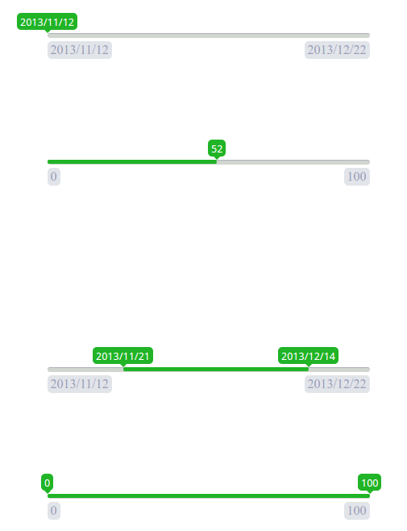

#range-picker

a range picker of JQuery plugins

Screenshot
---


Examples
---
1. see `sample` folder
2. [jsfiddle](https://jsfiddle.net/cqmyg/me1dmz9e/4/)

Browser Support
---
1. chrome
2. firefox
3. IE8+

Requirements
---
1. JQuery 1.7+

Usage
---

###Import css

```html
<link rel="stylesheet" href="../css/range-picker.css" type="text/css" charset="utf-8" />

```

###Import javascript

```html
<script src="../bower_components/jquery/dist/jquery.js" type="text/javascript" charset="utf-8"></script>
<script src="../src/range_picker.js" type="text/javascript" charset="utf-8"></script>

```
###Call
```javascript
$("#date_picker").rangepicker();
```

Options
---

####startValue

default: `none`

require: `true`

the left label. eg: "2016/01/03"

####endValue

default: `none`

require: `true`

the right label. eg: "2016/03/12"

####type

type: `String`

default: `single`

require: `false`

Choose picker type, could be `single` - for one cursor, or `double` for two cursors

######example
```js
$("#number_range").rangepicker({
    type: "double",
    startValue: 0,
    endValue: 100,
    translateSelectLabel: function(currentPosition, totalPosition) {
        return parseInt(100 * (currentPosition / totalPosition));
    }
});
```

####translateSelectLabel

type: `Function`

default: `none`

require: `true`

######parameter
1. `currentPosition` cursor position
2. `totalWidth` the width of process bar

get the text for cursor


######example
```js
$("#number_range").rangepicker({
    startValue: 0,
    endValue: 100,
    translateSelectLabel: function(currentPosition, totalPosition) {
        return parseInt(100 * (currentPosition / totalPosition));
    }
});
```

Function
---

####getSelectValue

get selected range


Build
---

First, get a copy of the git repo by running:

```shell
git clone https://github.com/zhangtasdq/range-picker.git
```

Enter the directory and install the dependencies:

```shell
cd range-picker && npm install && bower install
```

Build

```shell
grunt
```

Test

```shell
grunt test
```
