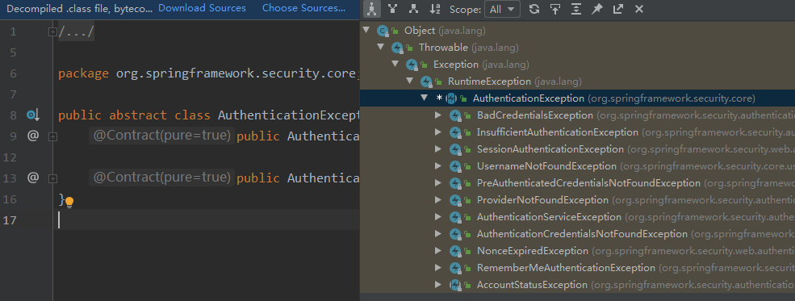
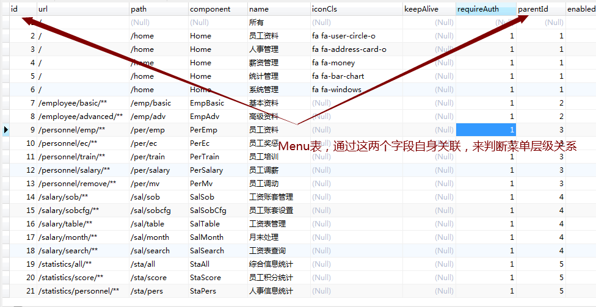
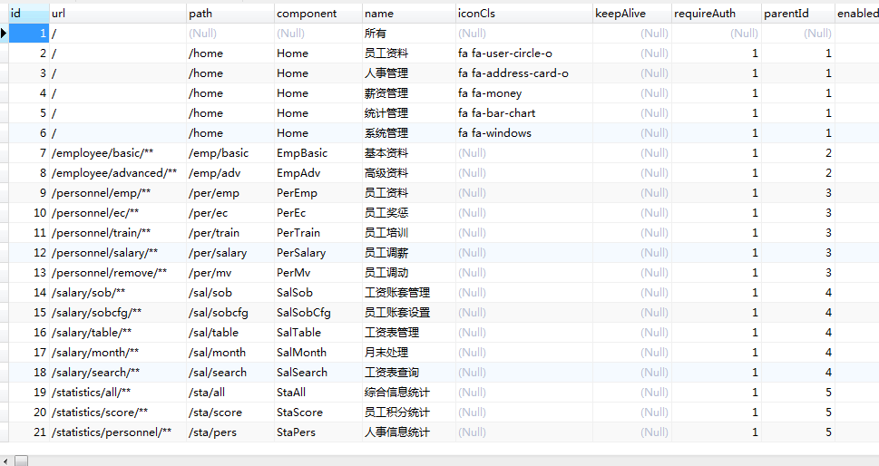
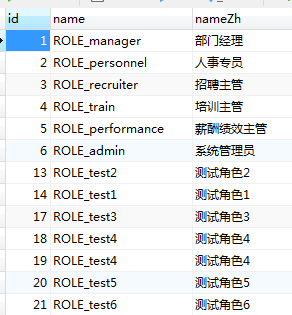
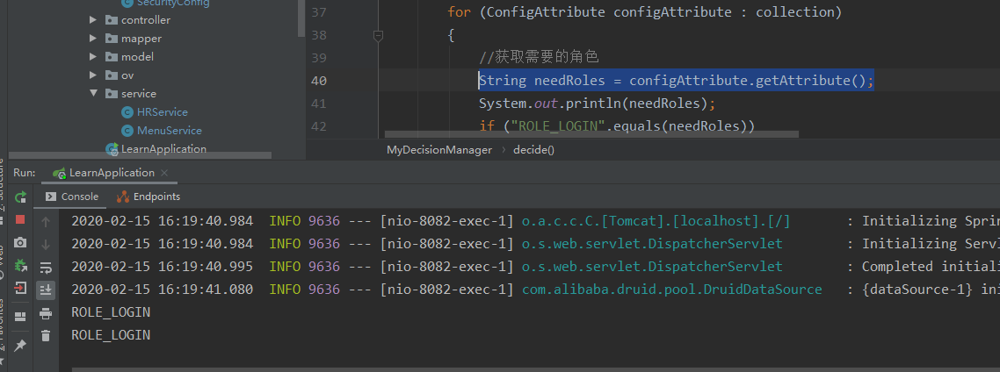
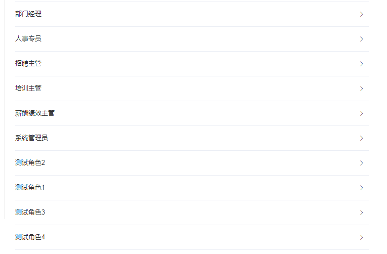
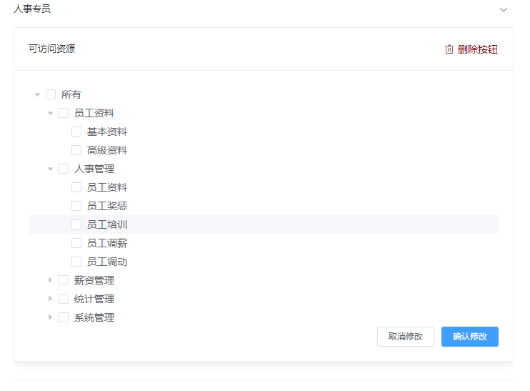
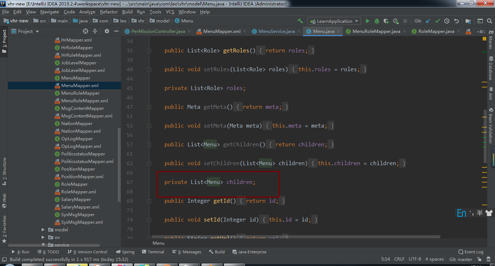

# 微人事项目后端技术点记录

## 一、基础环境准备

## 服务端

idea工具、本地Maven环境

## 前端

webstorm、nodejs

## 数据库

MySQL5.7

## 添加依赖文件

- ```xml
         <dependency>
              <groupId>org.springframework.boot</groupId>
              <artifactId>spring-boot-starter-security</artifactId>
          </dependency>
          <dependency>
              <groupId>org.springframework.boot</groupId>
              <artifactId>spring-boot-starter-web</artifactId>
          </dependency>
          <dependency>
              <groupId>org.mybatis.spring.boot</groupId>
              <artifactId>mybatis-spring-boot-starter</artifactId>
              <version>2.1.1</version>
          </dependency>
        
          <dependency>
              <groupId>mysql</groupId>
              <artifactId>mysql-connector-java</artifactId>
              <version>5.1.47</version>
          </dependency>
          <dependency>
              <groupId>com.alibaba</groupId>
              <artifactId>druid</artifactId>
              <version>1.1.10</version>
          </dependency>
  ```

## 数据库脚本

 https://gitee.com/mirrors/vhr/blob/master/vhr.sql 

## 逆向生成工具


## 本人更新项目码云地址

 https://gitee.com/thirtyleo/vhr 

# 二、Spring Security安全登陆

## 1.用户表需要实现UserDetails

```java
package com.leo.vhr.model;

import com.fasterxml.jackson.annotation.JsonIgnore;
import org.springframework.security.core.GrantedAuthority;
import org.springframework.security.core.authority.SimpleGrantedAuthority;
import org.springframework.security.core.userdetails.UserDetails;

import java.util.ArrayList;
import java.util.Collection;
import java.util.List;

public class Hr implements UserDetails
{
    private Integer id;

    private String name;

    private String phone;

    private String telephone;

    private String address;

    private Boolean enabled;

    private String username;

    private String password;

    private String userface;

    private String remark;

    public List<Role> getRoles()
    {
        return roles;
    }

    public void setRoles(List<Role> roles)
    {
        this.roles = roles;
    }

    private List<Role> roles;

    public Integer getId() {
        return id;
    }

    public void setId(Integer id) {
        this.id = id;
    }

    public String getName() {
        return name;
    }

    public void setName(String name) {
        this.name = name == null ? null : name.trim();
    }

    public String getPhone() {
        return phone;
    }

    public void setPhone(String phone) {
        this.phone = phone == null ? null : phone.trim();
    }

    public String getTelephone() {
        return telephone;
    }

    public void setTelephone(String telephone) {
        this.telephone = telephone == null ? null : telephone.trim();
    }

    public String getAddress() {
        return address;
    }

    public void setAddress(String address) {
        this.address = address == null ? null : address.trim();
    }

    public void setEnabled(Boolean enabled) {
        this.enabled = enabled;
    }

    public String getUsername() {
        return username;
    }

    @Override
    public boolean isAccountNonExpired()
    {
        return true;
    }

    @Override
    public boolean isAccountNonLocked()
    {
        return true;
    }

    @Override
    public boolean isCredentialsNonExpired()
    {
        return true;
    }

    @Override
    //因为我上面已经定义了enabled，所以这里返回我自己的enabled
    public boolean isEnabled()
    {
        return enabled;
    }

    public void setUsername(String username) {
        this.username = username == null ? null : username.trim();
    }

    @Override
    @JsonIgnore
    public Collection<? extends GrantedAuthority> getAuthorities()
    {
//        List<SimpleGrantedAuthority> authorities=new ArrayList<>(roles.size());
//        for (Role role : roles)
//        {
//            authorities.add(new SimpleGrantedAuthority(role.getName()));
//        }
        return null;
    }

    public String getPassword() {
        return password;
    }

    public void setPassword(String password) {
        this.password = password == null ? null : password.trim();
    }

    public String getUserface() {
        return userface;
    }

    public void setUserface(String userface) {
        this.userface = userface == null ? null : userface.trim();
    }

    public String getRemark() {
        return remark;
    }

    public void setRemark(String remark) {
        this.remark = remark == null ? null : remark.trim();
    }
}
```

## 2.服务层实现UserDetailsService

```java
package com.leo.vhr.service;

import com.leo.vhr.mapper.HrMapper;
import com.leo.vhr.model.Hr;
import org.springframework.beans.factory.annotation.Autowired;
import org.springframework.security.core.userdetails.UserDetails;
import org.springframework.security.core.userdetails.UserDetailsService;
import org.springframework.security.core.userdetails.UsernameNotFoundException;
import org.springframework.stereotype.Service;

/**
 * @description:
 * @author: Leo
 * @createDate: 2020/2/13
 * @version: 1.0
 */
@Service
public class HRService implements UserDetailsService
{
    @Autowired
    HrMapper hrMapper;
    @Override
    public UserDetails loadUserByUsername(String username) throws UsernameNotFoundException
    {
        Hr hr = hrMapper.loadUserByUsername(username);
        if(hr==null){
            throw new UsernameNotFoundException("查无此人！");
        }
        return hr;
    }
}

```

## 3.编写配置类

Mapper那里，我觉得没什么好说的，如果需要可以去码云上看代码，只是简单的通过用户名查询用户信息，loadUserByUsername这个方法见名知意。

关于配置类，本来我想简单粗暴写，直接像CSDN上那样，源码一通乱贴。但是我觉得那样应该就没人愿意看了，所以这里，我打算先把步骤说出来，简要的贴个型，源码呢，各位想看，就去码云上。

**先是添加加密**

大概从2.1这个版本以后，springboot创建security就得要加密了。但是了，springboot加密有一个好处，不用有salt（盐），不必去维护盐字段。

```java
   	@Bean
    PasswordEncoder passwordEncoder()
    {
        return new BCryptPasswordEncoder();
    }
```

**然后是用户信息管理配置**

springsecurity必须实现WebSecurityConfigurerAdapter方法，在这个基础上重写configure，里面的参数类型是AuthenticationManagerBuilder，得区分好，configure被重载了好几次呢。

```java
	@Override
    protected void configure(AuthenticationManagerBuilder auth) throws Exception
    {
        //当然显而易见，HRService要被注入进来咯
        auth.userDetailsService(hrService);
    }
```

**接着重写configure方法**

这个方法的重载这次的参数类型是HttpSecurity，很明显这是请求管理。接下来就是一大堆有名的链式编程。

```java
//所有请求必须认证才能登陆
http.authorizeRequests().anyRequest().authenticated()
```

接下来就是处理表单登陆

```java
.and()
.formLogin()//内部注册 UsernamePasswordAuthenticationFilter
.usernameParameter("username")//form表单用户名参数名
.passwordParameter("password")//form表单用户名参数名
.loginProcessingUrl("/doLogin") //这是请求登陆的URL，一定别少了这个/；默认是/login
.loginPage("/login") //设置登陆页地址
```

到了这里，然后我们就开始处理，如果成功怎么怎么办？如果失败怎么怎么办？如果注销怎么怎么办？

```java
.successHandler(new AuthenticationSuccessHandler()
                {
                    @Override
                    public void onAuthenticationSuccess(HttpServletRequest req, HttpServletResponse resp, Authentication auth) throws IOException, ServletException
                    {
                        
                    }
                })
```

```java
                .failureHandler(new AuthenticationFailureHandler()
                {
                    @Override
                    public void onAuthenticationFailure(HttpServletRequest req, HttpServletResponse resp, AuthenticationException e) throws IOException, ServletException
                    {
                        //源码里你会看到好多异常属性，应该会有一些兄弟很好奇，这些类是怎么来的？
                    }
                })
```

首先在这个方法的参数里你会看到AuthenticationException，按住Ctrl点进去，然后按住Ctrl+H




这就是异常类，使用的时候，你就去判断传入进来的异常是不是定义的异常的实例

 **A instanceof B ，返回值为boolean类型，用来判断A是否是B的实例对象或者B子类的实例对象。如果是则返回true,否则返回false。** 

## 4.关于RespBean的说明

其实他是一个返回数据的包装类，它里面定义了status状态码，msg返回文本，obj返回对象。然后又定义了静态方法，后面的控制层返回类型会大量的使用这个包装类，用来约束返回数据类型。

## 5.关于ObjectMapper的说明

他其实是Jackson包下面的一个方法，writeValueAsString是把当前的对象转换成字符串，然后后端再用PrintWriter发送出去。

```java
.csrf().disable();
```

将防止注入攻击关闭，不关闭用postman就测不了。

# 三、动态加载菜单项

## 1.修改Menu实体

首先添加一个Meta实体

```java
package com.leo.vhr.model;

/**
 * @description:
 * @author: Leo
 * @createDate: 2020/1/15
 * @version: 1.0
 */
public class Meta
{
    private Boolean keepAlive;

    private Boolean requireAuth;
   	//setter and getter...
}

```

```java
package com.leo.vhr.model;

import java.util.List;

public class Menu
{
    private Integer id;

    private String url;

    private String path;

    private String component;

    private String name;
    
    private String iconCls;

    private Integer parentid;

    private Boolean enabled;

    private Meta meta;

    private List<Role> roles;
    
    private List<Menu> children;
	//setter and getter...
}
```

先看一下正常返回的数据格式

```json
{
        "id":2,
        "url":"/",
        "path":"/home",
        "component":"Home",
        "name":"员工资料",
        "iconCls":"fa fa-user-circle-o",
        "parentid":1,
        "enabled":true,
        "meta":{
            "keepAlive":null,
            "requireAuth":true
        },
        "roles":null,
        "children":[
            {
                "id":7,
                "url":null,
                "path":"/emp/basic",
                "component":"EmpBasic",
                "name":"基本资料",
                "iconCls":null,
                "parentid":2,
                "enabled":true,
                "meta":{
                    "keepAlive":null,
                    "requireAuth":true
                },
                "roles":null,
                "children":null
            }
        ]
    }
```

## 2.编写控制层

```java
@RestController
@RequestMapping("/system/config")
public class SystemConfigController
{
    @Autowired
    MenuService menuService;

    @GetMapping("/menu")
    public List<Menu> getAllMenusById(){
        //这里的传入的ID不要使用前端传来的id，不安全
        //用户登录成功之后，id是保存在了内存里的
        return menuService.getAllMenusById();
    }
}
```

## 3.提供service

```java
@Service
public class MenuService
{
    @Autowired
    MenuMapper menuMapper;

    public List<Menu> getAllMenusById()
    {
        return menuMapper.getMenuByHrId(((Hr) SecurityContextHolder
                .getContext()
                .getAuthentication()
                .getPrincipal()).getId());
    }
}
```

SecurityContextHolder.getContext().getAuthentication().getPrincipal()是security框架用来获取用户信息的，然后强转成Hr类型，获取Hr的Id

## 4.编写SQL

```mysql
SELECT DISTINCT m1.*,m2.id id2,m2.component component2,m2.enabled enabled2,m2.iconCls iconCls2,m2.keepAlive keepAlive2,m2.`name` name2,m2.parentId parentId2,m2.requireAuth requireAuth2,m2.path path2 
FROM menu m1,menu m2,hr_role hrr,menu_role mr 
where m1.id=m2.parentId and hrr.hrid=5 and hrr.rid=mr.rid and mr.mid=m2.id and m2.enabled=true 
ORDER BY m1.id,m2.id;
```

这里看menu表结构



所以这里会用到自连接语句

# 四、权限接口设计


## 根据地址查询所需要的角色

我们想实现让对应的角色去访问对应的菜单，这种实现思路有哪些呢？

最简单的，我们会想到把所有的角色都查出来，然后根据对应角色来展现他们对应的菜单！这固然算是一种实现思路，但是从安全方面来考虑的话，显然欠缺。

所以我们要根据用户的请求来判断，这个请求所需要的角色，然后再判断当前用户是否含有这个角色！

在此之前，我也曾写过一篇博客写过关于用户认证与授权的问题，因为这个项目从后端角度来看，security可以说是核心大头，是项目的基石。

 https://blog.csdn.net/Curtisjia/article/details/104265019 

## 关于实体的改造

这里呢，我建议先去看之前的帖子，最好能敲一敲，可能我说的不详细，不够到位，但是敲一敲自己推敲总是有所感悟的，而我呢，只简单的说下实体类的一个注意点！

在对应的Hr实体里面放入用户角色

```java
    @Override
    public Collection<? extends GrantedAuthority> getAuthorities()
    {
        //这个list的泛型是GrantedAuthority的子类
        List<SimpleGrantedAuthority> authorities=new ArrayList<>(roles.size());
        for (Role role : roles)
        {
            authorities.add(new SimpleGrantedAuthority(role.getName()));
        }
        return authorities;
    }
```

## 其次要给登陆的用户角色赋值

HRService

```java
    @Override
    public UserDetails loadUserByUsername(String username) throws UsernameNotFoundException
    {
        Hr hr = hrMapper.loadUserByUsername(username);
        if(hr==null){
            throw new UsernameNotFoundException("查无此人！");
        }
        hr.setRoles(hrMapper.getHrRolesById(hr.getId()));
        return hr;
    }
```

对应的SQL	MenuService

```xml
<select id="getHrRolesById" resultType="com.leo.vhr.model.Role">
    select r.*
from role r,hr_role hrr
where hrr.rid=r.id and hrr.hrid=#{id}
</select>
```

根据用户角色获取对应他的菜单

```xml
    <resultMap id="MenusWithRole" type="com.leo.vhr.model.Menu" extends="BaseResultMap">
        <collection property="roles" ofType="com.leo.vhr.model.Role">
            <id column="rid" property="id"></id>
            <result column="rname" property="name"></result>
            <result column="rnameZh" property="nameZh"></result>
        </collection>
    </resultMap>  
	<select id="getAllMenusWithRole" resultMap="MenusWithRole">
    select m.*,r.id as rid,r.name as rname,r.nameZh as rnameZh
	from menu m,menu_role mr,role r
	where m.id=mr.mid and mr.rid=r.id
	ORDER BY m.id
  	</select>
```


然后过滤请求，下面我捋一下简单的思路。之前在博客也说了，但是可能没有说的特别清楚。

## 定义过滤类

这个类需要实现FilterInvocationSecurityMetadataSource，这么长我也记不住，记住前面几个单词过滤器，idea会有自动提示；

1. 获取当前用户发出的请求路径
2. 获取访问的菜单对应的路径

3. 用antPathMatcher匹配请求的URL是否合法
4. 如果合法，就要看他需要哪些角色
5. 如何返回？因为他的返回类型是Collection，所以security有一个类叫SecurityConfig（注意包！！！）里面有个createList，他的参数是可变长度数组，所以你还需要定义数组。遍历role来获取角色名

6. 问题来了，如果发出的请求，不合法，怎么做？那就返回一个标记符，来说明，如果没有匹配上，统一返回什么什么，然后去处理，匹配不上就去登陆！

   

## 再去判断当前用户是否拥有这个资格

1. 继承AccessDecisionManager，下面两个supports全部返回true

2. 遍历之前过滤器返回值 Collection<ConfigAttribute> collection

3. 获取他所需要的角色

   ```java
   String needRoles = configAttribute.getAttribute();
   ```

这里呢我还是很人性的打出了值，或者自己打断点去调，一样的



4. 如果当前用户是一个非法角色，看他是不是匿名用户，是抛异常，不是就不再执行。
5. 如果你是合法角色就判断你所拥有的角色是不是有他需要的角色，只要有就return

最后别忘了，给这两个类加@component注解！！！

## 配置类小改动

把刚才两个类注入进来之后，.anyRequest().authenticated()这个所有请求都得经过认证就可以不要了！

用withObjectPostProcessor，里面实现ObjectPostProcessor，他的泛型是FilterSecurityInterceptor，接着重写他的方法，也就是把myDecisionManager myFilter set进来

```java
 o.setAccessDecisionManager(myDecisionManager);
 o.setSecurityMetadataSource(myFilter);
```

# 五、职位批量删除实现

## 控制器提供一个数组参数

```java
    @DeleteMapping("/")
    public RespBean deletePositionsByIds(Integer[] ids)
    {
        if (positionService.deletePositionsByIds(ids) == ids.length)
        {
            return RespBean.ok("删除成功！");
        }
        return RespBean.error("删除失败！");
    }
```

## 实现SQL

服务层和Mapper的接口不必多说，主要是动态SQL的写法，我觉得很值得我去学习

```xml
 <delete id="deletePositionByAll">
    delete from position where id in
    <foreach collection="ids" item="id" open="(" close=")" separator=",">
      #{id}
    </foreach>
  </delete>
```

这里我跟韦哥研究了一下，他拼接出来的效果应该是 delete from position where id in (1,2,3...)这样的

**参数说明：**

1. foreach循环标签
2. collection集合对象，也就是数组参数
3. item 迭代集合时，元素的别名 
4. open：包裹被迭代集合元素的开始符号，一般为"("
5. close：包裹被迭代集合元素的结束符号，一般为")"
6. separator：被迭代元素之间的分隔符，一般为","

# 六、权限组菜单树的展示

效果图





这里最外层是折叠面板，渲染角色名称，里面展开是用的elementUI的树形控件，根据官网示例我们可以看出，树形控件会根据你所提供的数据结构来自动渲染。

## 实现SQL

```xml

   <resultMap id="MenuWithChildren" type="com.leo.vhr.model.Menu" extends="BaseResultMap">
        <id column="id1" property="id"></id>
        <result column="name1" property="name"></result>
        <collection property="children" ofType="com.leo.vhr.model.Menu">
            <id column="id2" property="id"></id>
            <result column="name2" property="name"></result>
            <collection property="children" ofType="com.leo.vhr.model.Menu">
                <id column="id3" property="id"></id>
                <result column="name3" property="name"></result>
            </collection>
        </collection>
    </resultMap>
<select id="getAllMenus" resultMap="MenuWithChildren">
  SELECT
	m1.id AS id1,
	m1.NAME AS name1,
	m2.id AS id2,
	m2.NAME AS name2,
	m3.id AS id3,
	m3.NAME AS name3 
FROM
	menu m1,
	menu m2,
	menu m3 
WHERE
	m1.id = m2.parentId 
	AND m2.id = m3.parentId 
	AND m3.enabled = TRUE 
ORDER BY
	m1.id,
	m2.id,
	m3.id
  </select>
```

这里使用的自连接查询，返回的数据子项被放进children属性里。因为这里层级是确定的，所以这里可以这么写，如果是不定的话可能会用递归方式来调用



